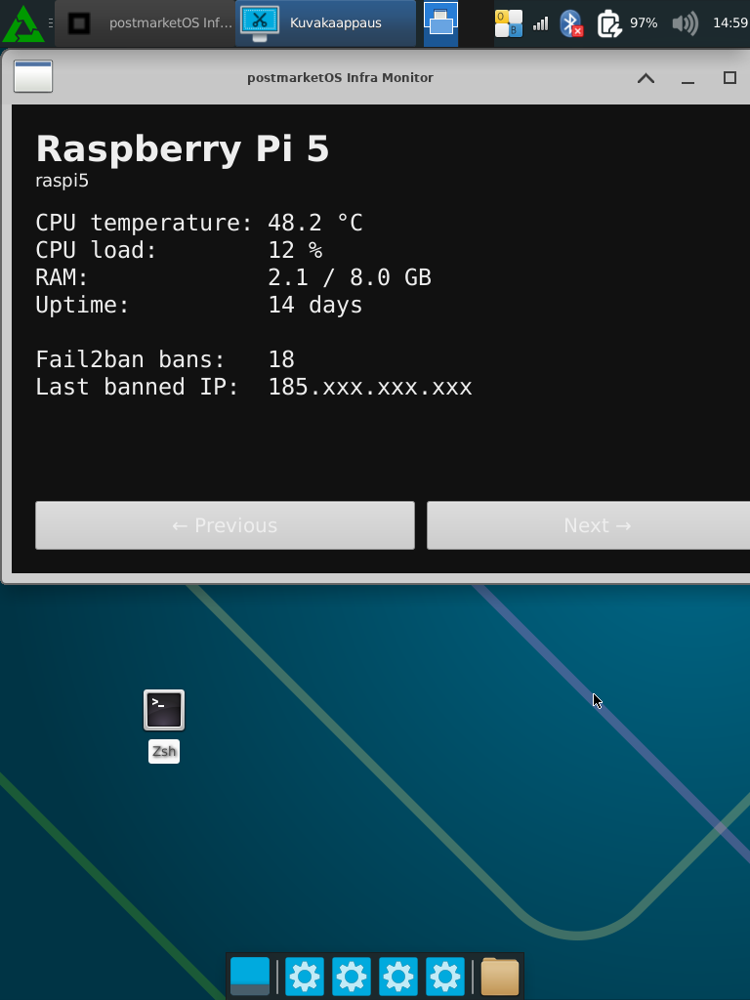
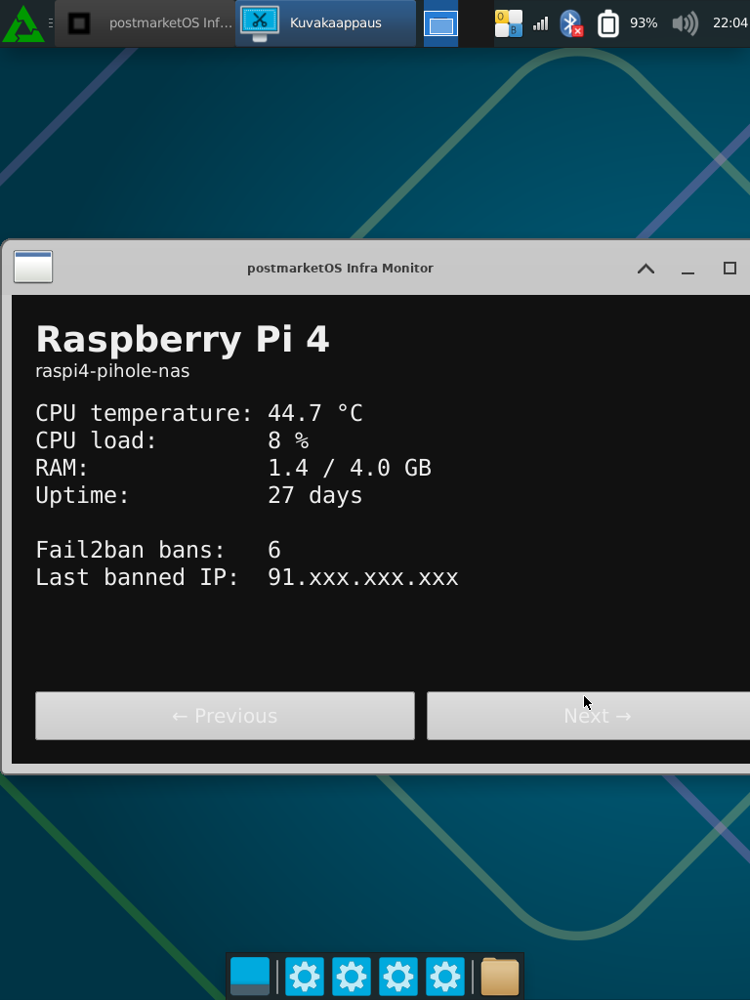

# postmarketos-infra-monitor

A touch-friendly GTK monitoring application for Raspberry Pi and self-hosted infrastructure.

## Overview

This project aims to turn a postmarketOS-powered tablet into a dedicated infrastructure monitoring device.

The application displays telemetry from Raspberry Pi systems and self-hosted services in a tablet-friendly interface, with support for multiple devices and touch-based navigation.

## Current Features

- GTK-based native Linux application
- Runs on postmarketOS
- Tablet-friendly layout
- Multiple device views
- JSON-based telemetry data source
- Raspberry Pi test devices included

## Screenshot

### Current Prototype




## Project Goals

The long-term goal is to provide a lightweight monitoring dashboard for:

- Raspberry Pi systems
- Docker hosts
- Fail2ban status
- Service health
- Self-hosted infrastructure

The application is designed for dedicated monitoring tablets rather than traditional desktop use.

## Roadmap

### v0.2

- Implement touch swipe navigation between device views
- Improve tablet-oriented layout
- Add additional telemetry fields

### v0.3

- Retrieve telemetry from real Raspberry Pi devices
- Display Docker container status
- Display Fail2ban statistics

### v0.4

- Offline device detection
- Automatic refresh
- Multi-host support

## Tested Platform

- Samsung Galaxy Tab A 9.7 LTE (SM-T555)
- postmarketOS
- XFCE4
- Python 3
- GTK3

## Development Notes

The application is developed and tested directly on the target postmarketOS device.

Current prototype uses static JSON telemetry data for UI development before integrating real telemetry collection.

## Repository Structure

```text
postmarketos-infra-monitor/
├── data/
│   ├── raspi4.json
│   └── raspi5.json
├── screenshots/
├── src/
│   └── app.py
├── run.sh
└── README.md
```

## Running

Launch the application on the tablet:

```bash
./run.sh
```

Or manually:

```bash
DISPLAY=:0 python3 src/app.py
```

## License

MIT
